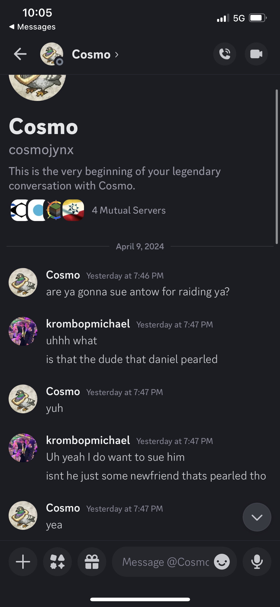

# KrombopulosMichael v. Antow, April 2024
## Case

With x1025 presiding, on the 10th of April 2024, KrombopulosMichael charged Antow with raiding. Antow was found guilty and sentenced to 10 days, time already served included.

## Proceedings
**krombopmichael**:

> I want to sue Antow for raiding me. That was not very chill of him. 
> 
> 
> `@ezwin46578` 
> `@Husky`

**vilyanz**:

> Who's antow

**Husky**:

> I’ll handle this later today
> `@krombopmichael` so who are you suing? its not clear to me

**krombopmichael**:

> I wanna sue the dude who raided me
> 

> I didn’t know his name until this message from cosmo
> Forgive me I don’t have a lot of context here. I only heard about the incident after, I and went to check the damage

**Husky**:

> Do they have a discord? Also why did you ping ezwin?

**krombopmichael**:

> i was told to pink husky

**solitaire1**:

> Frank = husky
> Antow doesn't have a discord. He never joined the discord as he was caught raiding so soon after joining the city
> If he took nothing of value from you then it's unlikely the lawsuit would come to much. He would probably be sentenced to 1-2 weeks pearled at most - we're keeping him pearled until his pearl runs out anyway which is 2 weeks whether there's a trial or not
> If you did lose valuables then he'd likely get reps ontop of the time but tbh I don't think he'll ever log in again. Since we have no discord for him the trial would take place without him being present

**Husky**:

> The court will hear the case of Enzo VS Antow for raiding. 
> `@x1025` will be presiding
> 
> All parties please familiarize or refresh yourselves on the court procedure. 
> 
> https://docs.google.com/document/d/1urUJ9o7k2CByBADDL66sHWqrjucepf6FzqIYRAxThgc/edit?usp=sharing Everyone involved please look over this to familiarize yourself with the procedure  of the court.
> 
> Also note any extraneous comments in this channel not related to the trial or anyone not called by the courts to present  testimony will be deleted from this point until the end of trial. Please hold any other cases till the end as well. I SHOULDNT HAVE TO PUT THIS BUT ANYONE PARTICPATING IN THE TRIAL PLEASE WAIT TO SPEAK UNTIL CALLED UPON BY YOUR JUDGE AND LET THEM KNOW WHEN YOU HAVE FINISHED YOUR STATEMENTS.

**krombopmichael**:

> I kinda thought the same thing. However Cosmo mentioned it and i figured why not.

**x1025**:

> I have been appointed by High Justice Husky to preside as judge over this trial. The prosecution `@krombopmichael` shall now proceed with an official opening statement

**krombopmichael**:

> Ill try to keep it brief. On April 1st Solitaire alerted me that a new friend broke into my house and a few of my chests had been broken. Solitaire and Awesome_daniel pearled the newfriend. I logged on and assessed the samage. By my count 2 double chests and 2 single chests were broken. I can't say for sure what I lost because my chests were very disorganized. However, I know a ton of miscellaneous build mats were in there, including stone prismarine and terracotta.

**x1025**:

> At this time, the defense would present an opening statement. As the defense is not in the Discord, I call upon `@krombopmichael` to call upon any witnesses and present any evidence (snitch recordings, pictures, dms, etc) that supports his complaint

**krombopmichael**:

> The only two people to my knowledge that witnessed the incident are `@solitaire1` and `@awesome_daniel`
> I do not have snithces, I am still quite noobish in that department
> `@solitaire1` `@awesome_daniel`

**solitaire1**:

> I came back to Altepetl after doing some mining and knew that mechanical had recruited a new friend earlier but logged out soon after. I decided to check on the new friend and found him in Krombo's house breaking chests with items from already broken chests on the floor around him.
> 
> I didn't have any armour or weapons on my person at the time but Daniel was nearby so I asked him to come and help me and he swiftly killed the new friend pearling him.
> 
> We picked up any items that were on the floor around us or that had dropped from the new friends dead body, I noticed nothing of too much value, it was mostly an assortment of building blocks and junk

**awesome_daniel**:

> I was also in Altepetl when Solitaire notified me that Antow was raiding Krombo’s house. Solitaire then asked for my assistance in pearling Antow. When I agreed, he proceeded to guide me to where Antow was raiding and I went ahead and pearled them.
> 
> It was clear that Antow was indeed raiding, as they were actively breaking chests when I went to pearl them. When they were killed, I didn’t notice anything particularly of significance drop from the body, but it was clear that they had a full inventory of stolen materials upon their death.

**x1025**:

> As receiving a statement from the defense is not possible (as well as cross examination) I now will allow the plaintiff (and defendant, but they are not here) to submit any additional facts that may be deemed necessary for the court, if any.
> After that (or if there are no additional facts to submit), I will next ask for a closing statement

**krombopmichael**:

> I have no further evidence or screenshots at this time

**x1025**:

> Alright, I call on the plaintiff to offer a closing statement before I choose a verdict and sentencing (apologies for being so slow about this)
> `@krombopmichael`  ^

**MechanicalRift**:

> `@krombopmichael`

**krombopmichael**:

> I see
> I have no further information beyond the witness accounts from Daniel and Solitaire. For lack of a better closing statement, I believe the evidence speaks for itself.

**x1025**:

> Alright, my verdict is - Guilty
> Sentence: 10 days, (time already served in included in this)
> This means that Antow has already served their sentence, though is unlikely to log back in to the server

**krombopmichael**:

> Thats neat!

**x1025**:

> I apologize for the trial taking so long

**krombopmichael**:

> No worries my fault too

