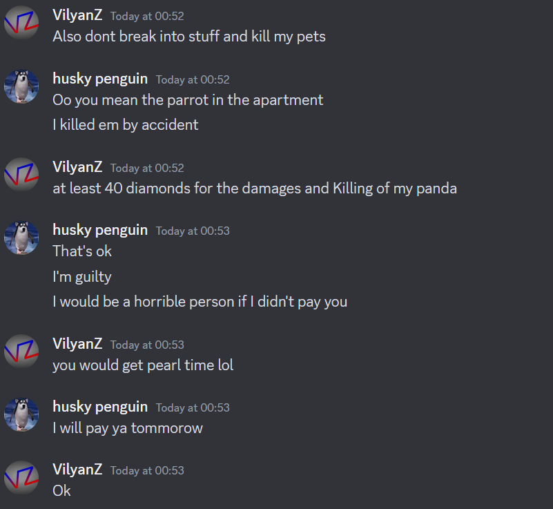

# VilyanZ v. Ezwin, Feb 2024

## Case

With Yergo presiding, on 10th of February 2024, VilyanZ charged Ezwin with greifing. Ezwin pleased gulty to griefing, but was ultimately settled out of court. Ezwin paid 40 diamonds in total for damages.

## Proceedings

**vilyanz**:

> `@Husky` I want to sue `@ezwin46578` for greifing.

**ezwin46578**:

> Huhw
> Wdym
> Hat did I do
> What
> `@vilyanz`

**Husky**:

> acknowledged, will sort out the full details in a bit

**ezwin46578**:

> Wait what
> Wha
> Bruh
> Bro
> He didnt even tell why
> He wants to sue me
> I mean what did I grief
> If I did even I can pay
> If you talk about the soup I have dropped to ahme
> It was an
> Giveway

**vilyanz**:

> we have to wait until the high justice like does some stuff

**ezwin46578**:

> im scared...
> but tell me what did i gried?
> grief
> `@vilyanz`

**vilyanz**:

> when the court case starts

**ezwin46578**:

> bruh
> lemme guess
> i cant guess
> Ok if you talk about the break in in art shop im sorry I wanted to buy pissdog
> Also where can I see rules
> ?

**vilyanz**:

> `@Husky` ??

**Husky**:

> The court will hear the case of Vilyanz VS Ezwin46578 for greifing.
> `@yergo` will be presiding
>
> All parties please familiarize or refresh yourselves on the court procedure.
>
> https://docs.google.com/document/d/1urUJ9o7k2CByBADDL66sHWqrjucepf6FzqIYRAxThgc/edit?usp=sharing Everyone involved please look over this to familiarize yourself with the procedure of the court.
>
> Also note any extraneous comments in this channel not related to the trial or anyone not called by the courts to present testimony will be deleted from this point until the end of trial. Please hold any other cases till the end as well. I SHOULDNT HAVE TO PUT THIS BUT ANYONE PARTICPATING IN THE TRIAL PLEASE WAIT TO SPEAK UNTIL CALLED UPON BY YOUR JUDGE AND LET THEM KNOW WHEN YOU HAVE FINISHED YOUR STATEMENTS.

**ezwin46578**:

> Oh f
> I am guity
> Guilty
> I didnt know where to find or read rules
> I am ready to pay the reparations in next week
> Is that ok
> I am guilty in breking chests
> I won't do that again
> But I pay reparations

**solitaire1**:

> You are able to talk to Vilyanz and attempt to resolve this out of court. If Vilyanz does not wish to then the trial goes ahead inline with the Code of Court Procedure

**ezwin46578**:

> I hope he agrees

**yergo**:

> `@vilyanz` do you want to solve this out of court?

**vilyanz**:

> its resloved with him paying me 40 diamonds for killing my panda

**yergo**:

> o7
> trial closed
